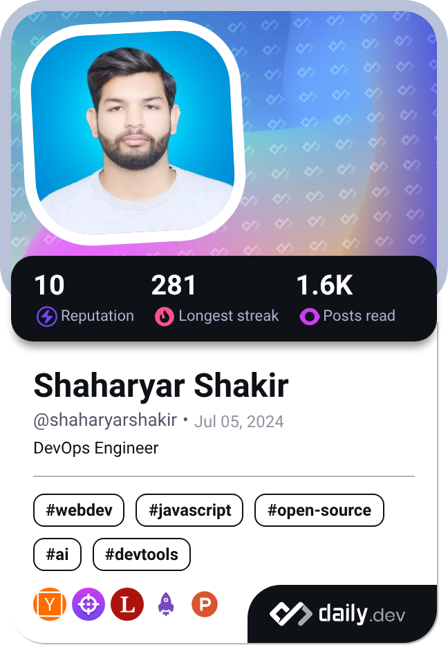

## Hi there 👋

<h1 align="center">I'm ShaharyarShakir</h1>
<h3 align="center">A passionate Full Stack Developer</h3>

**`Digital Craftsman (Developer)`**
<p align="left"> <a href="https://twitter.com/" target="blank"></a> </p>

- 🔭 I’m currently working on **Wordpress Theme**

- 🌱 I’m currently learning **JS, Devops, Linux**

- 👯 I’m looking to collaborate on **Open Source**

- 💬 Ask me about **JS AND Linux**

- 📫 How to reach me **shakirshaharyar125@gmail.com**

- ⚡ Fun fact **I Love Anime and Coding**


## 🌐 Socials:
[](https://linkedin.com/in/https://www.linkedin.com/in/shaharyar-shakir-3674a027b/) 

# 💻 Languages and Tools:
        
<!--START_SECTION:waka-->


**🐱 My GitHub Data** 

> 📦 ? Used in GitHub's Storage 
 > 
> 🏆 47 Contributions in the Year 2025
 > 
> 🚫 Not Opted to Hire
 > 
> 📜 13 Public Repositories 
 > 
> 🔑 0 Private Repositories 
 > 
**I'm an Early 🐤** 

```text
🌞 Morning                100 commits         ██████████░░░░░░░░░░░░░░░   40.98 % 
🌆 Daytime                80 commits          ████████░░░░░░░░░░░░░░░░░   32.79 % 
🌃 Evening                57 commits          ██████░░░░░░░░░░░░░░░░░░░   23.36 % 
🌙 Night                  7 commits           █░░░░░░░░░░░░░░░░░░░░░░░░   02.87 % 
```
📅 **I'm Most Productive on Monday** 

```text
Monday                   50 commits          █████░░░░░░░░░░░░░░░░░░░░   20.49 % 
Tuesday                  26 commits          ███░░░░░░░░░░░░░░░░░░░░░░   10.66 % 
Wednesday                49 commits          █████░░░░░░░░░░░░░░░░░░░░   20.08 % 
Thursday                 15 commits          ██░░░░░░░░░░░░░░░░░░░░░░░   06.15 % 
Friday                   31 commits          ███░░░░░░░░░░░░░░░░░░░░░░   12.70 % 
Saturday                 36 commits          ████░░░░░░░░░░░░░░░░░░░░░   14.75 % 
Sunday                   37 commits          ████░░░░░░░░░░░░░░░░░░░░░   15.16 % 
```


📊 **This Week I Spent My Time On** 

```text
🕑︎ Time Zone: Asia/Karachi

💬 Programming Languages: 
PHP                      2 hrs 48 mins       ████████████████████░░░░░   78.57 % 
JavaScript               31 mins             ████░░░░░░░░░░░░░░░░░░░░░   14.44 % 
SCSS                     7 mins              █░░░░░░░░░░░░░░░░░░░░░░░░   03.71 % 
HTML                     6 mins              █░░░░░░░░░░░░░░░░░░░░░░░░   03.00 % 
JSON                     0 secs              ░░░░░░░░░░░░░░░░░░░░░░░░░   00.22 % 

🔥 Editors: 
VS Code                  3 hrs 34 mins       █████████████████████████   100.00 % 

🐱‍💻 Projects: 
public                   2 hrs 56 mins       █████████████████████░░░░   82.28 % 
js-practice              31 mins             ████░░░░░░░░░░░░░░░░░░░░░   14.71 % 
Wordpress                6 mins              █░░░░░░░░░░░░░░░░░░░░░░░░   03.00 % 

💻 Operating System: 
Windows                  3 hrs 3 mins        █████████████████████░░░░   85.29 % 
Linux                    31 mins             ████░░░░░░░░░░░░░░░░░░░░░   14.71 % 
```

**I Mostly Code in HTML** 

```text
HTML                     18 repos            ██████████████░░░░░░░░░░░   56.25 % 
CSS                      7 repos             █████░░░░░░░░░░░░░░░░░░░░   21.88 % 
JavaScript               6 repos             █████░░░░░░░░░░░░░░░░░░░░   18.75 % 
JSON                     1 repo              █░░░░░░░░░░░░░░░░░░░░░░░░   03.12 % 
```


**Timeline**


 Last Updated on 26/01/2025 18:42:38 UTC
<!--END_SECTION:waka-->
<details>
<summary>:collision: GitHub Stats</summary> 

</details>

<details>
  <summary>:zap: Dev Card</summary>
  <a href="https://app.daily.dev/shaharyarshakir">
    </a>
</details>

<!-- Simple Icons Repo: https://github.com/simple-icons/simple-icons
Simple Icons Site: https://simpleicons.org/
GitHub Readme Stats: https://github.com/anuraghazra/github-readme-stats
Shields Repo: https://github.com/badges/shields
Shields Site: https://Shields.io
Badges 4 Readme Profile: https://github.com/alexandresanlim/Badges4-README.md-Profile
Markdown Badges: https://github.com/Ileriayo/markdown-badges
GitHub Activity Readme: https://github.com/marketplace/actions/github-activity-readme
Profile Readme Stats: https://github.com/marketplace/actions/profile-readme-development-stats
Spotify Now Playing: https://github.com/natemoo-re/natemoo-re
Spotify Now Playing: https://github.com/novatorem/novatorem
GitHub Profile Readme Generator: https://github.com/rahuldkjain/github-profile-readme-generator
Profile Examples: https://github.com/abhisheknaiidu/awesome-github-profile-readme
-->
<!-- Proudly created with GPRM ( https://gprm.itsvg.in ) -->
