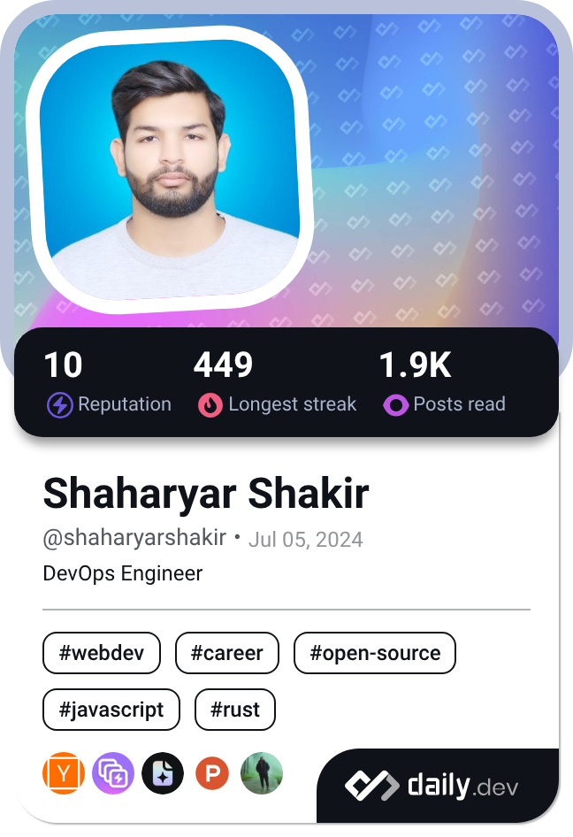

# ShaharyarShakir

**`Digital Craftsman (Developer)`**

I am an enthusiastic programmer, Student and a developer building my own version of the digital world one step at a time. My journey is guided by an endless curiosity and a desire to explore new frontiers in programming. I thrive on solving intricate problems and constantly seek opportunities to challenge myself and elevate my skills to new heights.

 

<!-- 
  

 -->
<!-- 
Currently learning  -> Full-stack Development

Currently working on -> Private Projects
 -->

<!-- 

  

 -->

## 🌐 Socials

 

---
## 🛠️ Tech Stack

### 🎨 Frontend Development

---

### 📱 Mobile Development

---

### ⚙️ Backend Development

---

### 🧩 Databases & ORMs

---

### 🤖 Machine Learning & AI

---

### 🔬 MLOps & ML Infrastructure

---

### 🧮 Data Science & Visualization

---

### 🗄️ Object Storage & File Storage

---

### ☁️ Cloud & Hosting

---

### 🐳 DevOps & Infrastructure

---

### 🧪 Testing & Code Quality

---

### 🔌 APIs & Communication

---

### 📦 Package Managers & Build Tools

---

### 🛠️ Version Control & Collaboration

---

### 🎨 Design & Prototyping

---

### 📄 Templating & UI

---
<!-- <table align="center">
<tr>
<td align="center"> <b>HTML (Markup)</b></td>
<td align="center"> <b>CSS (Stylesheet)</b></td> 
<td align="center"> <b>JavaScript (Language)</b></td>
<td align="center"> <b>Tailwind (Framework)</b></td>
<td align="center"> <b>SCSS (Library)</b></td>
<td align="center"> <b>C (Language)</b></td>
 <td align="center">  NeoVim(text editor) </td>
 <td align="center">  Linux(OS) </td> 

</tr>
  <tr>
   <td align="center">  Vagrant(vm manager) </td>
    <td align="center"> <b>Cloud Computing</b></td>
      <td align="center">  Jenkins(CICD) </td> 
        <td align="center">  python </td> 
</tr>

   
</table> -->

# 📊 My Github stats

  
 

  
  
   

   

 

  

  
:zap: Dev Card

  

     

<!-- Simple Icons Repo: https://github.com/simple-icons/simple-icons
Simple Icons Site: https://simpleicons.org/
GitHub Readme Stats: https://github.com/anuraghazra/github-readme-stats
Shields Repo: https://github.com/badges/shields
Shields Site: https://Shields.io
Badges 4 Readme Profile: https://github.com/alexandresanlim/Badges4-README.md-Profile
Markdown Badges: https://github.com/Ileriayo/markdown-badges
GitHub Activity Readme: https://github.com/marketplace/actions/github-activity-readme
Profile Readme Stats: https://github.com/marketplace/actions/profile-readme-development-stats
Spotify Now Playing: https://github.com/natemoo-re/natemoo-re
Spotify Now Playing: https://github.com/novatorem/novatorem
GitHub Profile Readme Generator: https://github.com/rahuldkjain/github-profile-readme-generator
Profile Examples: https://github.com/abhisheknaiidu/awesome-github-profile-readme
-->
<!-- Proudly created with GPRM ( https://gprm.itsvg.in ) -->
